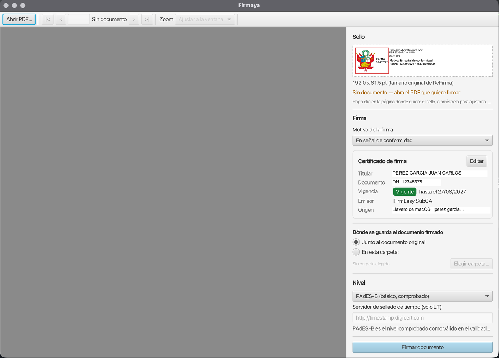

# Firmaya

Firma digital de documentos PDF en macOS, con tu propio certificado y sin depender de Windows.



## Por qué

El firmador oficial de RENIEC, **ReFirma PDF, solo existe para Windows**. La plataforma
Firma Perú sí tiene versión de macOS, pero ahí **solo funciona con DNIe** y lector de tarjetas,
no con un certificado en archivo.

Quien firma desde una Mac con un certificado `.p12` se quedaba sin herramienta. Firmaya cubre
ese hueco.

## Qué hace

- Firma PDF en formato **PAdES-BASELINE-B**, el mismo que ReFirma
- Sello visible con las medidas del de RENIEC, dibujado a **384 dpi**
- Coloca el sello **donde quieras**, en la página que quieras, con un clic
- Lee el certificado de un archivo `.p12` o del **llavero de macOS**
- **Se configura una vez**: después firma sin volver a pedir la contraseña
- Permite **varias firmas** sobre el mismo documento, sin invalidar las anteriores

## Validado oficialmente

Un PDF firmado con Firmaya fue sometido al
[validador de Firma Perú](https://apps.firmaperu.gob.pe/web/validador.xhtml), la plataforma
de firma digital del Estado peruano:

> **Resultado válido** — Firmas procesadas (1), Firmas válidas (1), `PAdES_BASELINE_B`
> *Generado por: Plataforma Nacional de Firma Digital - Firma Perú 1.1.0 | DSS 5.11.1*

Por eso PAdES-B es el nivel por defecto y su lógica de firma no se toca.

## Instalación

Descarga `Firmaya-1.0.0.dmg` de la sección [Releases](../../releases), ábrelo y arrastra
**Firmaya** a Aplicaciones. Incluye su propio Java: no hace falta instalar nada más.

La primera vez macOS la bloqueará por no estar firmada con una cuenta de Apple Developer.
Ábrela con **clic derecho → Abrir**, o quita la marca de cuarentena:

```bash
xattr -dr com.apple.quarantine "/Applications/Firmaya.app"
```

**Requisitos**: macOS con Apple Silicon y un certificado digital de una entidad acreditada.

## Cómo se usa

1. **Cargar certificado** — una sola vez; la contraseña queda en el Llavero de macOS
2. **Abrir PDF**, ir a la página que quieras y hacer clic donde vaya el sello
3. **Firmar documento** — se guarda como `documento[R].pdf` y se abre para revisarlo

## Documentación

| | |
|---|---|
| [Guía de uso](docs/uso.md) | La ventana, el certificado, dónde se guarda, PAdES-LT y la línea de comandos |
| [ReFirma y los validadores](docs/refirma.md) | Qué se averiguó del firmador oficial, por qué hay dos validadores y qué falta para el sello de tiempo |
| [Desarrollo](docs/desarrollo.md) | Compilar, empaquetar el `.dmg`, firmar y notarizar, y limitaciones conocidas |

## Licencia

**LGPL-2.1** — ver [LICENSE](LICENSE) y [NOTICE.md](NOTICE.md).

Puedes usarla libremente, también con fines comerciales. Si la modificas y distribuyes esa
versión, debes publicar los cambios bajo la misma licencia.

## Aviso

Firmaya **no es un producto de RENIEC** ni está afiliada a esa institución. Es un desarrollo
independiente construido sobre [DSS](https://github.com/esig/dss), la implementación de
referencia de ETSI que usa el propio ReFirma, y reproduce su formato para que los documentos
resulten familiares a quien los recibe.

La validez legal de una firma depende del **certificado**, no del programa que la genera. Usa
un certificado emitido por una entidad acreditada ante INDECOPI y comprueba el resultado en el
validador oficial.
